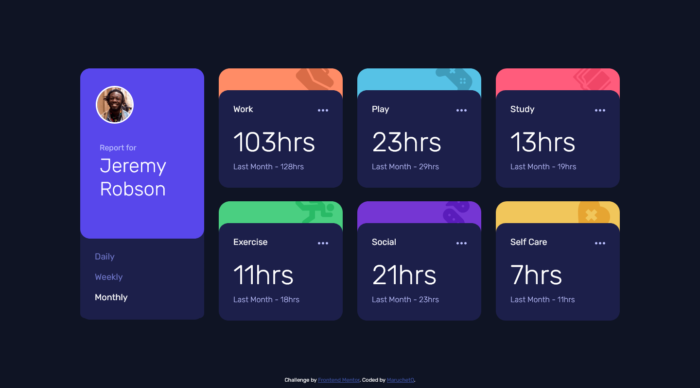

# Frontend Mentor - Time tracking dashboard solution

This is a solution to the [Time tracking dashboard challenge on Frontend Mentor](https://www.frontendmentor.io/challenges/time-tracking-dashboard-UIQ7167Jw). Frontend Mentor challenges help you improve your coding skills by building realistic projects. 

## Table of contents

- [Overview](#overview)
  - [The challenge](#the-challenge)
  - [Screenshot](#screenshot)
  - [Links](#links)
- [My process](#my-process)
  - [Built with](#built-with)
  - [What I learned](#what-i-learned)
  - [Continued development](#continued-development)
  - [Useful resources](#useful-resources)
- [Author](#author)
- [Acknowledgments](#acknowledgments)

**Note: Delete this note and update the table of contents based on what sections you keep.**

## Overview

### The challenge

Users should be able to:

- View the optimal layout for the site depending on their device's screen size
- See hover states for all interactive elements on the page
- Switch between viewing Daily, Weekly, and Monthly stats

### Screenshot



### Links

- Live Site URL: [Link](https://marucheto.github.io/Time-tracking-dashboard/)

## My process

### Built with

- Semantic HTML5 markup
- CSS custom properties
- Flexbox
- CSS Grid
- Mobile-first workflow

### What I learned

```css
/* CSS Backgrounds */
.activity-cover {
  height: 45px;
  /* https://www.w3schools.com/css/css3_backgrounds.asp */
  background-image: url(./images/icon-work.svg);
  background-position: 90%;
  background-repeat: no-repeat;
}
```
```js
// toDashCase
// https://stackoverflow.com/questions/47836390/how-to-convert-a-camel-case-string-to-dashes-in-javascript
function toDashCase(title) {
  return title.replace(/\s+/g, "-").toLowerCase();
}

// Populating the DOM
// https://www.frontendmentor.io/learning-paths/javascript-fundamentals-oR7g6-mTZ-/steps/67bdebd18e9721b35e0ae64e/article/read
function loadDataClick(values) {
  // fetch the JSON data
  const promise = fetch("data.json")
    .then((response) => {
      if (!response.ok) return console.log("Oops! Something went wrong.");

      return response.json();
    })
    .then((data) => {
      // handle the data
      populateDOM(data, values);
    });

  return promise;
}
// append the data to the DOM
function populateDOM(data, values) {
  
}
```

If you want more help with writing markdown, we'd recommend checking out [The Markdown Guide](https://www.markdownguide.org/) to learn more.

### Continued development

Use this section to outline areas that you want to continue focusing on in future projects. These could be concepts you're still not completely comfortable with or techniques you found useful that you want to refine and perfect. >> Clean the code

### Useful resources

- [CSS Backgrounds](https://www.w3schools.com/css/css3_backgrounds.asp)
- [toDashCase](https://stackoverflow.com/questions/47836390/how-to-convert-a-camel-case-string-to-dashes-in-javascript) 
- [Populating the DOM](https://www.frontendmentor.io/learning-paths/javascript-fundamentals-oR7g6-mTZ-/steps/67bdebd18e9721b35e0ae64e/article/read) 

## Author

- Frontend Mentor - [@MaruchetO](https://www.frontendmentor.io/profile/MaruchetO)
